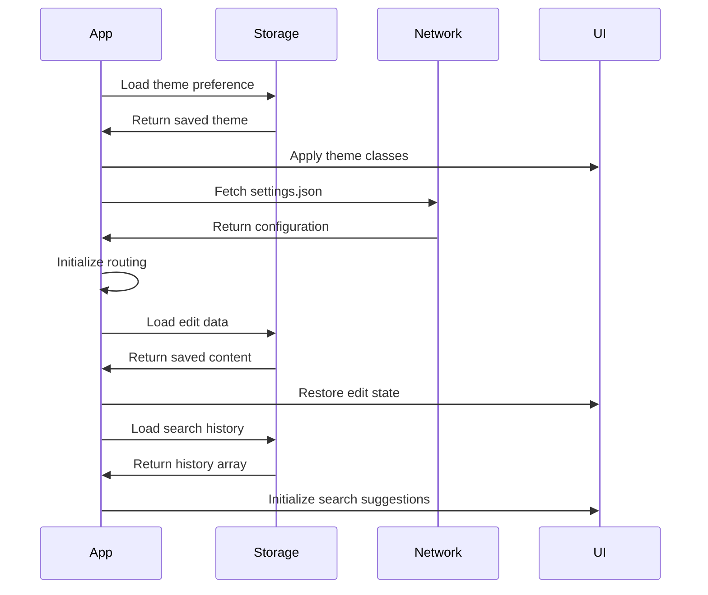

# Configuration Map - Law Office Guide App

## Configuration Sources

### JSON Configuration Files

| file | purpose | loaded by | affects |
|------|---------|-----------|---------|
| src/data/settings.json | App routing and core settings | app.js:79 | page routing, app behavior |
| src/data/contacts.json | Contact information | dynamic loading | contacts page content |
| src/data/procedures.json | Legal procedures data | dynamic loading | procedures page content |
| src/data/general-info.json | General information | dynamic loading | general info page content |

### localStorage Configuration

| key | type | default | set by | affects | persistence |
|-----|------|---------|---------|---------|-------------|
| theme | string | 'light' | utils.js theme toggle | CSS classes, UI appearance | permanent |
| guide-edit-data | object | null | EditMode.saveData() | edit mode content state | until cleared |
| guide-undo-data | object | null | EditMode undo system | undo/redo functionality | until cleared |
| guide_draft_ts | number | null | EditMode.markDirty() | draft state tracking | until cleared |
| searchHistory | array | [] | SearchComponent | search suggestions | permanent |

## Environment Variables

**Status: No environment variables detected**
- No process.env usage found
- No import.meta.env usage found  
- No build-time configuration
- Pure client-side configuration

## Feature Flags

**Status: No explicit feature flags found**
- No conditional feature toggles detected
- All functionality appears to be always enabled
- Configuration is data-driven rather than feature-driven

## Configuration Schema (Inferred)

### settings.json Structure
```json
{
  "routing": {
    "routes": [
      {
        "path": "string",
        "file": "string", 
        "title": "string"
      }
    ],
    "defaultRoute": "string"
  },
  "ui": {
    "theme": "string",
    "language": "string"
  },
  "features": {
    "editMode": "boolean",
    "search": "boolean", 
    "export": "boolean"
  }
}
```

### Data File Structures
```json
// contacts.json
{
  "contacts": [
    {
      "id": "string",
      "name": "string",
      "role": "string",
      "email": "string",
      "phone": "string"
    }
  ]
}

// procedures.json  
{
  "procedures": [
    {
      "id": "string",
      "title": "string",
      "description": "string",
      "steps": ["string"],
      "category": "string"
    }
  ]
}
```

## Configuration Loading Flow



## Configuration Hierarchy

1. **Hardcoded defaults** (in source code)
2. **settings.json** (loaded at startup)
3. **localStorage** (user preferences/data)
4. **Dynamic data files** (loaded per route)

## Runtime Configuration

### Theme Configuration
```javascript
// From utils.js - theme management
const themeConfig = {
  default: 'light',
  storage_key: 'theme',
  css_classes: {
    light: 'light-theme',
    dark: 'dark-theme'
  }
}
```

### Routing Configuration
```javascript
// From app.js - routing setup
const routingConfig = {
  trigger_events: ['hashchange', 'popstate'],
  default_route: '#/',
  container: '#app',
  page_path: 'src/pages/',
  file_extension: '.html'
}
```

### Edit Mode Configuration
```javascript
// From edit-mode.js - editing behavior
const editConfig = {
  auto_save: true,
  draft_interval: 'on_change',
  storage_keys: {
    data: 'guide-edit-data',
    undo: 'guide-undo-data', 
    timestamp: 'guide_draft_ts'
  }
}
```

## Configuration Validation

### Current Validation
- **JSON parsing**: Basic try-catch in data loading
- **localStorage**: No validation before storage
- **Data types**: No runtime type checking

### Missing Validation
- **Schema validation**: No JSON schema enforcement
- **Data integrity**: No checksums or validation
- **Version compatibility**: No migration strategy
- **Required fields**: No mandatory field checking

## Configuration Security

### Security Considerations
- **localStorage exposure**: All config stored in plain text
- **No encryption**: Sensitive data readable by any script
- **XSS vulnerability**: Injected scripts can read all config
- **No access control**: No user-based configuration

### Recommendations
1. **Sensitive data**: Move to secure storage or server-side
2. **Validation**: Add schema validation for all config
3. **Encryption**: Encrypt sensitive localStorage data
4. **Audit logging**: Track configuration changes

## Configuration Testing

### Current State
- **No config tests**: No validation of configuration files
- **No mock configs**: No test environment configurations
- **No validation tests**: No schema validation testing

### Recommended Testing
```javascript
// Example configuration tests needed
describe('Configuration', () => {
  test('settings.json has valid structure', () => {
    // Validate JSON schema
  });
  
  test('localStorage config is preserved', () => {
    // Test persistence
  });
  
  test('invalid config is handled gracefully', () => {
    // Test error handling
  });
});
```

## Performance Impact

### Configuration Loading Performance
- **settings.json**: ~1KB, loaded once at startup
- **Data files**: ~5KB total, loaded dynamically per route
- **localStorage**: Synchronous access, minimal impact
- **Total config overhead**: <10ms on modern browsers

### Optimization Opportunities
1. **Config caching**: Cache parsed JSON in memory
2. **Lazy loading**: Load data files only when needed
3. **Compression**: Gzip configuration files
4. **Bundling**: Include small configs in main bundle

## Configuration Migration Strategy

### Current Limitations
- **No versioning**: No way to handle config format changes
- **No migration**: Breaking changes would lose user data
- **No backward compatibility**: Old versions can't handle new config

### Recommended Migration System
```javascript
const configMigration = {
  version: '1.0.0',
  migrations: {
    '1.0.0': (oldConfig) => newConfig,
    '1.1.0': (oldConfig) => newerConfig
  },
  migrate: (config) => {
    // Apply sequential migrations
  }
}
```

## Development vs Production Configuration

### Current State
- **Single configuration**: Same config for all environments
- **No environment detection**: No dev/prod differences
- **Debug settings**: No debug flags or development helpers

### Recommended Environment Handling
```javascript
// Environment-specific configuration
const config = {
  development: {
    debug: true,
    api_base: 'http://localhost:3000',
    log_level: 'debug'
  },
  production: {
    debug: false,
    api_base: 'https://api.lawoffice.com',
    log_level: 'error'
  }
}
```

## Configuration Documentation

### Missing Documentation
- **Config file schemas**: No formal schema definitions
- **Default values**: Not clearly documented
- **Required vs optional**: No clear distinction
- **Examples**: No example configurations provided

### Recommended Documentation Structure
1. **Schema documentation**: JSON schema files
2. **Configuration guide**: Usage examples
3. **Migration guide**: Version upgrade instructions
4. **Troubleshooting**: Common configuration issues