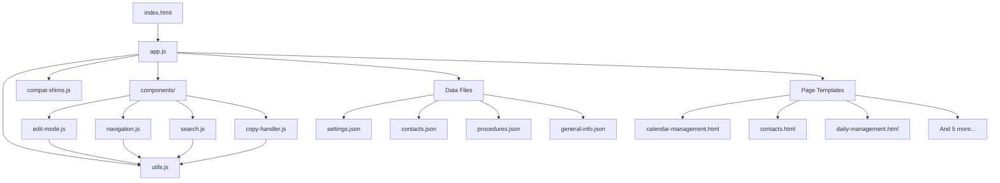
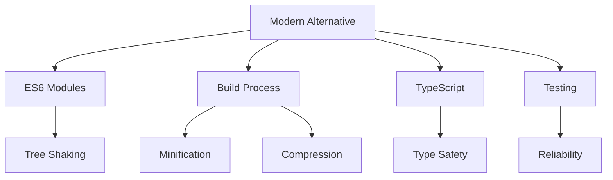

# Dependencies - Law Office Guide App

## External Dependencies

**Status: ZERO external dependencies**
- No npm packages installed
- No CDN resources
- Pure Vanilla JavaScript implementation

```bash
# From npm_tree.txt analysis:
No npm packages found
```

## Internal Module Dependencies

### Core Application Dependencies



### Import/Export Analysis

**No ES6 modules detected** - All dependencies are loaded via script tags and global scope

| File | Depends On | Exports | Used By |
|------|------------|---------|---------|
| app.js | utils.js, compat-shims.js, components/*.js | LawOfficeGuideApp (global) | index.html |
| utils.js | none | Utils (global) | app.js, all components |
| compat-shims.js | none | compatibility fixes | app.js |
| edit-mode.js | utils.js | EditMode (global) | app.js |
| navigation.js | utils.js | Navigation (global) | app.js |
| search.js | utils.js | SearchComponent (global) | app.js |
| copy-handler.js | utils.js | CopyHandler (global) | app.js |

### Data Dependencies

| Component | Data Files | Purpose |
|-----------|------------|---------|
| LawOfficeGuideApp | src/data/settings.json | App configuration and routing |
| Page Loader | src/pages/*.html | Dynamic page content |
| EditMode | localStorage | Data persistence |
| SearchComponent | localStorage | Search history |

## Browser API Dependencies

### Core Web APIs Used
- **localStorage**: Critical for data persistence
- **fetch**: For loading JSON data and HTML pages
- **Clipboard API**: For copy functionality
- **FileReader API**: For import functionality
- **History API**: For SPA routing (hashchange, popstate)
- **DOM APIs**: Extensive use of getElementById, querySelector, etc.

### Browser Compatibility Requirements

| API | Minimum Browser Version | Fallback Available |
|-----|------------------------|-------------------|
| localStorage | IE8+ | No |
| fetch | Chrome 42+, Firefox 39+ | No (could use XMLHttpRequest) |
| Clipboard API | Chrome 66+, Firefox 63+ | No |
| FileReader | IE10+ | No |
| CSS Grid | Chrome 57+, Firefox 52+ | Limited |
| ES6 Classes | Chrome 49+, Firefox 45+ | No |
| Arrow Functions | Chrome 45+, Firefox 22+ | No |

## Bundle Analysis

### File Sizes (estimated)
```
src/assets/js/app.js          ~15KB (main application)
src/assets/js/utils.js        ~8KB  (utilities)
src/components/edit-mode.js   ~12KB (editing functionality)
src/components/navigation.js  ~6KB  (navigation)
src/components/search.js      ~10KB (search functionality)
src/components/copy-handler.js ~5KB  (copy operations)
src/assets/js/compat-shims.js ~3KB  (compatibility)

Total JavaScript: ~59KB (uncompressed)
```

### CSS Dependencies
```
src/assets/css/main.css       ~10KB (main styles)
src/assets/css/components.css ~8KB  (component styles)

Total CSS: ~18KB (uncompressed)
```

### Data Files
```
src/data/*.json               ~5KB  (configuration data)
src/pages/*.html              ~20KB (page templates)

Total Assets: ~25KB
```

**Total Bundle Size: ~102KB (uncompressed)**

## Performance Impact

### Positive Aspects
- **No external requests**: All resources are local
- **No build step**: Direct browser execution
- **Small bundle**: Under 100KB total
- **No dependency conflicts**: Pure vanilla implementation

### Performance Concerns
- **No tree-shaking**: All code is loaded regardless of usage
- **No compression**: Files are served uncompressed
- **No caching strategy**: Dynamic loading without cache headers
- **No lazy loading**: All components loaded upfront

## Security Analysis

### Supply Chain Security
- **Risk Level: MINIMAL** - No external dependencies
- **No third-party code**: Eliminates supply chain attacks
- **No version conflicts**: No dependency management needed

### Potential Vulnerabilities
- **Outdated browser APIs**: No polyfills for security fixes
- **No input sanitization**: Direct DOM manipulation without escaping
- **localStorage exposure**: Data stored in plain text

## Recommendations

### Short Term
1. **Add compression**: Gzip/Brotli for all static assets
2. **Implement caching**: Add proper cache headers
3. **Add input sanitization**: Prevent XSS attacks
4. **Consider polyfills**: For broader browser support

### Long Term
1. **Module system**: Convert to ES6 modules
2. **Build process**: Add bundling and minification
3. **TypeScript**: Add type safety
4. **Testing framework**: Add unit/integration tests
5. **Progressive enhancement**: Graceful degradation for older browsers

### Alternative Architecture


## Migration Strategy

If considering adding dependencies:

### Phase 1: Build Tools
- Add Vite/Webpack for bundling
- Convert to ES6 modules
- Add TypeScript

### Phase 2: Libraries (if needed)
- Consider lightweight alternatives:
  - **Date handling**: date-fns (2KB) vs moment.js (67KB)
  - **HTTP client**: native fetch (0KB) vs axios (15KB)
  - **State management**: native (0KB) vs redux (47KB)

### Phase 3: Modern Features
- Service Worker for offline support
- Web Components for better encapsulation
- IndexedDB for complex data storage

## Dependency Risk Assessment

| Category | Risk Level | Mitigation |
|----------|------------|------------|
| External Dependencies | **NONE** | No external code to worry about |
| Browser API Changes | **LOW** | APIs are stable and well-supported |
| Internal Coupling | **MEDIUM** | Global scope creates tight coupling |
| Data Dependencies | **HIGH** | localStorage can be cleared/corrupted |
| Performance Impact | **LOW** | Small bundle size, local resources |