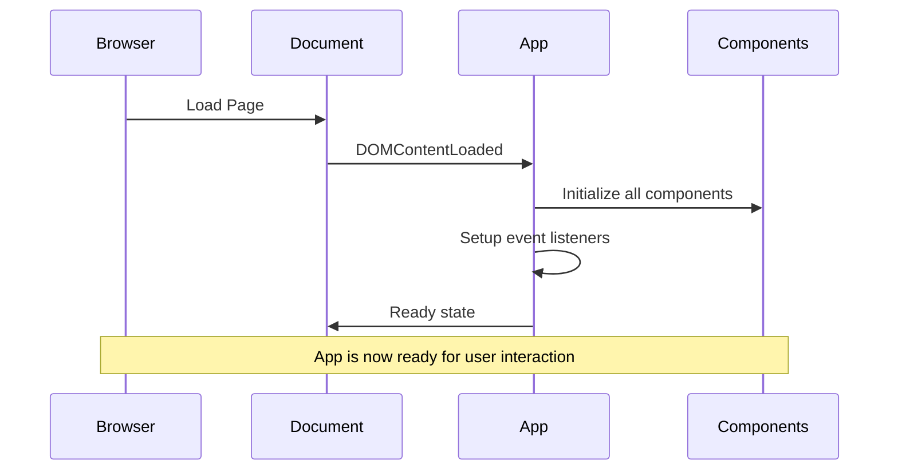
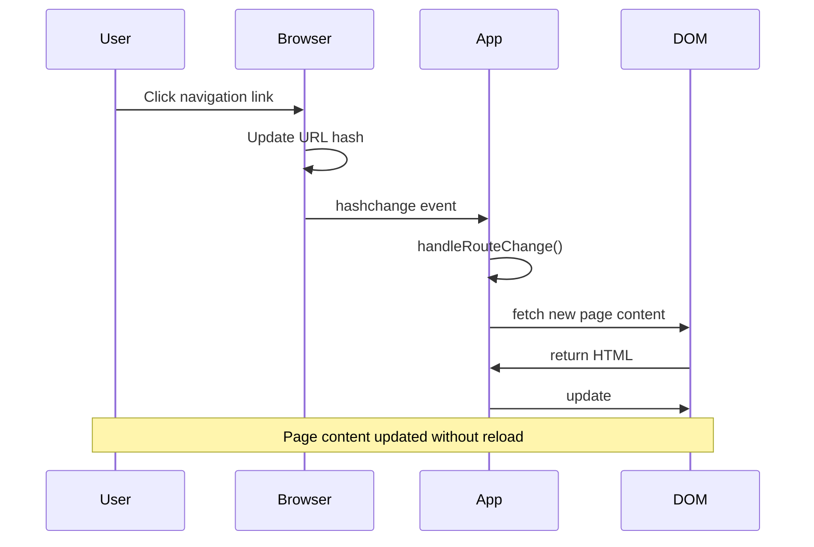
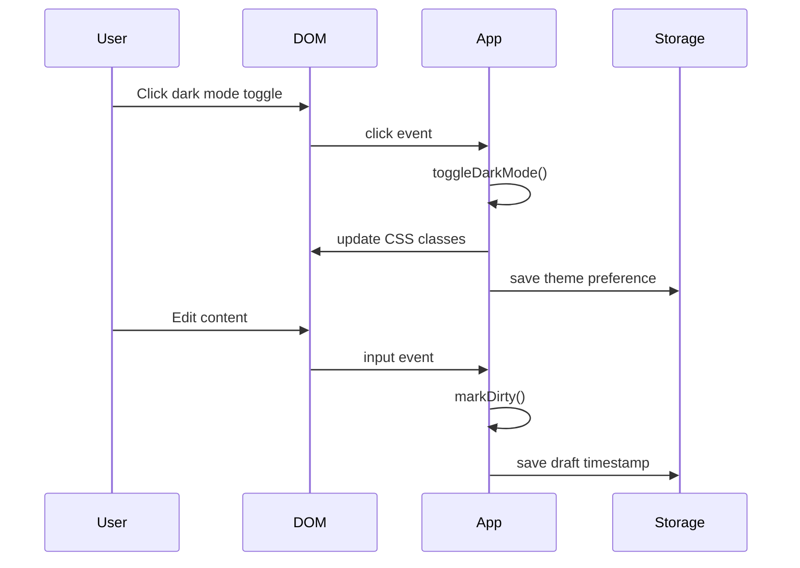
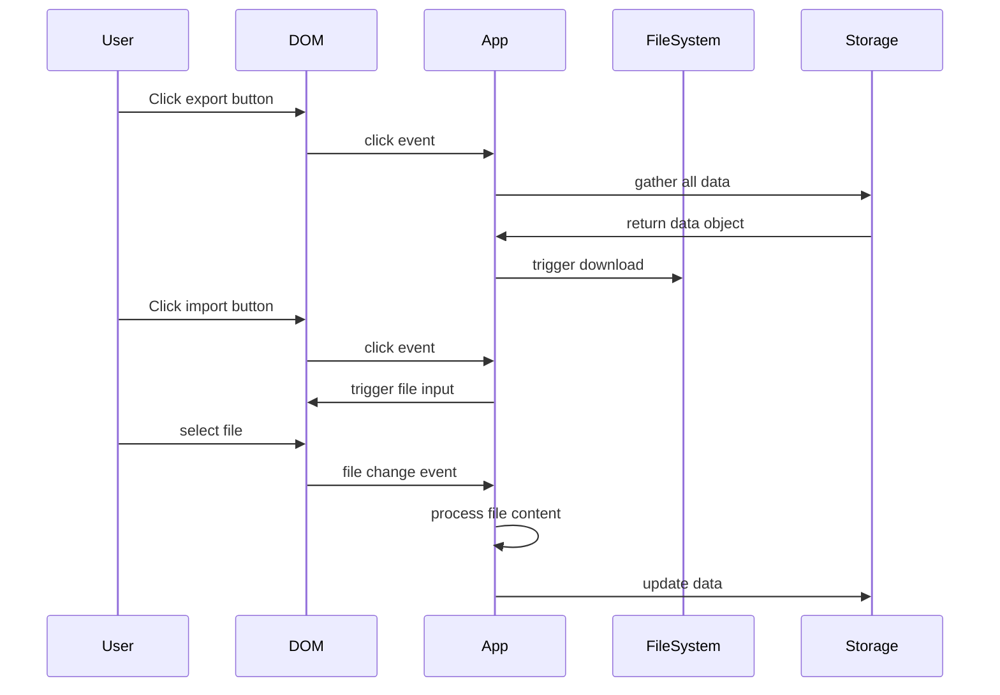

# Event Flow - Law Office Guide App

## Event Listeners & Handlers Table

| event | target | selector/id | handler | file:line | notes |
|-------|--------|-------------|---------|-----------|-------|
| DOMContentLoaded | document | document | initApp | src/assets/js/app.js:547 | app initialization entry point |
| hashchange | window | window | handleRouteChange | src/assets/js/app.js:132 | SPA routing on URL hash change |
| popstate | window | window | handleRouteChange | src/assets/js/app.js:133 | browser back/forward navigation |
| beforeunload | window | window | handleBeforeUnload | src/assets/js/app.js:141 | cleanup before page unload |
| visibilitychange | document | document | handleVisibilityChange | src/assets/js/app.js:144 | page visibility state changes |
| click | button | #darkModeToggle | toggleDarkMode | src/assets/js/app.js:149 | theme toggle functionality |
| click | button | #actionsMenuBtn | anonymous function | src/assets/js/app.js:156 | actions menu toggle |
| click | document | document | anonymous function | src/assets/js/app.js:162 | close actions menu on outside click |
| click | button | #exportBtn | exportData | src/assets/js/app.js:174 | trigger data export |
| click | button | #importBtn | importData | src/assets/js/app.js:178 | trigger data import |
| change | input[file] | #fileImport | anonymous function | src/assets/js/app.js:431 | file import processing |
| load | FileReader | FileReader instance | anonymous function | src/assets/js/app.js:436 | file content reading |
| input | form elements | various | markDirty | src/assets/js/compat-shims.js:51 | mark form as modified |
| click | button | .close-btn | anonymous function | src/assets/js/utils.js:261 | close toast notifications |
| click | document | document | handleCopyClick | src/components/copy-handler.js:233 | copy functionality trigger |
| load | FileReader | FileReader instance | anonymous function | src/components/edit-mode.js:441 | edit mode file processing |

## Custom Events

| event name | dispatch location | listeners | purpose |
|------------|-------------------|-----------|---------|
| None found | - | - | No custom events detected in current analysis |

## Event Flow Diagrams

### Application Lifecycle Events

### Navigation Flow

### User Interaction Flow

### Data Operations Flow

## Event Propagation Patterns

### Global Document Events
- **click on document**: Used for closing menus/dropdowns when clicking outside
- **DOMContentLoaded**: Single entry point for app initialization
- **visibilitychange**: Performance optimization for when tab is not active

### Component-Specific Events
- **CopyHandler**: Listens on document for copy button clicks (event delegation)
- **EditMode**: File input changes for content import
- **Navigation**: Hash changes for routing

## Event Handler Responsibilities

### Core App Handlers (app.js)
| handler | responsibilities |
|---------|------------------|
| initApp | Initialize app instance, bind global events |
| handleRouteChange | Parse route, load content, update UI |
| handleBeforeUnload | Cleanup, save dirty state |
| handleVisibilityChange | Pause/resume operations |
| toggleDarkMode | Theme switching, persistence |
| exportData | Data serialization, file download |
| importData | File reading, data validation |

### Component Handlers
| component | handler | responsibilities |
|-----------|---------|------------------|
| CopyHandler | handleCopyClick | Clipboard operations, user feedback |
| EditMode | file change | Content parsing, validation, storage |
| Navigation | route events | Active state management |
| SearchComponent | input events | Search execution, history management |

## Performance Considerations

### Event Throttling/Debouncing
- **Input events**: debounced in utils.js:317 for performance
- **Scroll events**: Not found in current analysis
- **Resize events**: Not found in current analysis

### Memory Management
- **Event cleanup**: No explicit removeEventListener calls found
- **Potential memory leaks**: Event handlers may accumulate over time
- **Recommendation**: Add cleanup in component destroy methods

## Error Handling in Events

### Current Error Handling
- **File operations**: Basic try-catch in file reading
- **localStorage**: No error handling visible
- **Network requests**: Basic error handling in fetch operations

### Missing Error Handling
- **Event handler failures**: No global error boundary
- **DOM manipulation errors**: Could fail silently
- **Storage quota exceeded**: Not handled

## Security Considerations

### Event-Related Security
- **XSS risk**: Dynamic content loading without sanitization
- **File upload**: No validation on imported files
- **Click jacking**: No frame-busting detected

### Recommendations
1. Add input sanitization for all user content
2. Validate file types and content before processing
3. Implement CSP headers
4. Add click-jacking protection