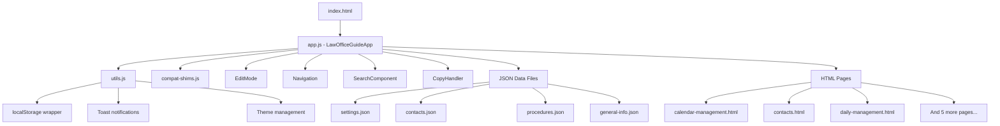
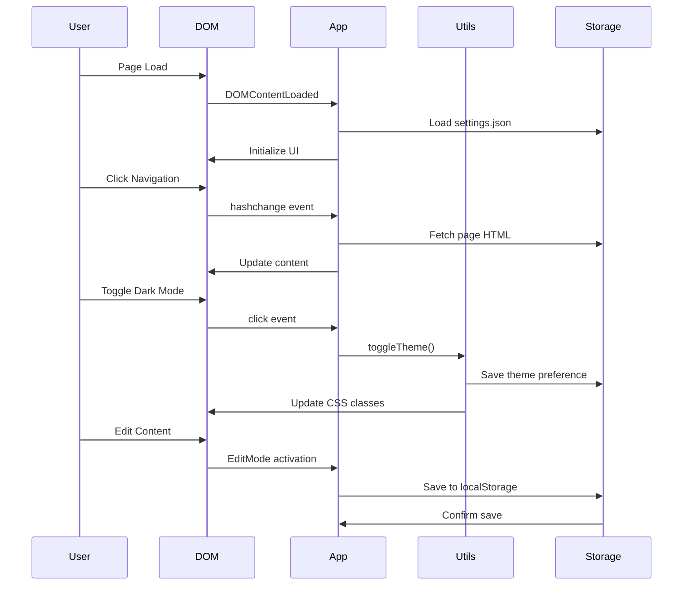
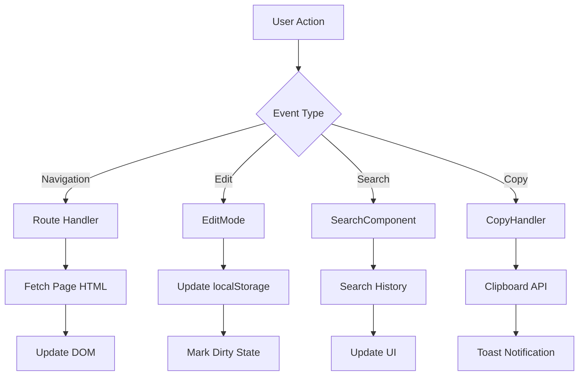

# System Map - Law Office Guide App

## Key Insights (Top 10)

1) **Single Page Application Architecture**: הפרויקט בנוי כ-SPA עם routing client-side ללא תלויות חיצוניות
2) **Component-Based Structure**: 5 קלאסים מודולריים עם אחריות מובחנת (App, EditMode, Navigation, Search, CopyHandler)
3) **Heavy LocalStorage Usage**: 4 מפתחות שונים לשמירת נתונים, עריכות ומטמון - נקודת סיכון לאיבוד נתונים
4) **Dynamic Page Loading**: טעינת דפי HTML דינמית ונתוני JSON עם fetch API
5) **No External Dependencies**: אין npm packages - הכל vanilla JS, פחות complexity אבל יותר קוד בית
6) **Event-Heavy Architecture**: 10+ event listeners לטיפול באינטראקציות משתמש ו-lifecycle
7) **Theme Management**: מערכת dark/light mode עם persistence ב-localStorage
8) **Import/Export Functionality**: יכולות גיבוי ושחזור נתונים דרך JSON files
9) **Edit Mode with Undo**: מערכת עריכה מתקדמת עם undo/redo וdraft management
10) **Search with History**: רכיב חיפוש עם שמירת היסטוריה ואוטו-complete

## Project Tree (condensed)

```
├── index.html (entry point)
├── package.json 
├── src/
│   ├── assets/
│   │   ├── css/ (components.css, main.css)
│   │   └── js/ (app.js, utils.js, compat-shims.js)
│   ├── components/ (copy-handler.js, edit-mode.js, navigation.js, search.js)
│   ├── data/ (contacts.json, general-info.json, procedures.json, settings.json)
│   └── pages/ (8 HTML pages: calendar, contacts, daily, financial, etc.)
└── docs/ (generated documentation)
```

## Modules and Dependencies (Mermaid)



## Functions Table

| name | file | line | type | params | returns | side effects | deps |
|------|------|------|------|--------|---------|--------------|------|
| LawOfficeGuideApp | src/assets/js/app.js | 6 | class | none | instance | DOM manipulation, routing | utils.js |
| initApp | src/assets/js/app.js | 541 | function | none | void | DOM init, event binding | LawOfficeGuideApp |
| handleRouteChange | src/assets/js/app.js | ~200 | method | none | void | DOM updates, page loading | fetch API |
| toggleDarkMode | src/assets/js/app.js | ~380 | method | none | void | CSS class changes, localStorage | utils.js |
| exportData | src/assets/js/app.js | ~400 | method | none | void | file download trigger | none |
| importData | src/assets/js/app.js | ~420 | method | none | void | file input trigger | none |
| EditMode | src/components/edit-mode.js | 6 | class | none | instance | content editing, persistence | utils.js |
| saveData | src/components/edit-mode.js | ~350 | method | data | void | localStorage write | localStorage |
| restoreData | src/components/edit-mode.js | ~500 | method | none | object | localStorage read | localStorage |
| Navigation | src/components/navigation.js | 6 | class | none | instance | menu management | none |
| SearchComponent | src/components/search.js | 6 | class | none | instance | search functionality | localStorage |
| CopyHandler | src/components/copy-handler.js | 6 | class | none | instance | clipboard operations | Clipboard API |

## UI/DOM Components Table

| id/selector | type | file:line | listeners | handlers | purpose |
|-------------|------|-----------|-----------|----------|---------|
| #app | container | app.js:235 | none | content loading | main app container |
| #darkModeToggle | button | app.js:147 | click | toggleDarkMode | theme switcher |
| #actionsMenuBtn | button | app.js:153 | click | menu toggle | actions menu trigger |
| #actionsMenu | dropdown | app.js:154 | document click | hide menu | actions dropdown |
| #exportBtn | button | app.js:170 | click | exportData | data export trigger |
| #importBtn | button | app.js:171 | click | importData | data import trigger |
| #fileImport | input[file] | app.js:428 | change | file processing | file upload input |
| #loadingOverlay | overlay | app.js:346 | none | show/hide | loading state indicator |

## Event Flow (Mermaid)



## Risk Assessment

| Component | Risk Level | Issue | Impact | Mitigation |
|-----------|------------|-------|---------|------------|
| localStorage | **HIGH** | Data loss on storage clear | Critical - all user data | Implement regular export, add backup mechanism |
| EditMode | **MEDIUM** | Complex state management | Data corruption | Add data validation, improve error handling |
| Dynamic Loading | **MEDIUM** | Network failures | Page load failures | Add retry logic, offline fallback |
| Event Handling | **LOW** | Memory leaks | Performance degradation | Add cleanup in destroy methods |
| File Import | **MEDIUM** | Malformed JSON | App crash | Add JSON validation, error boundaries |

## Configuration Map

| key | defined in | default | affects | notes |
|-----|------------|---------|---------|-------|
| theme preference | localStorage | 'light' | CSS classes | managed by utils.js |
| guide-edit-data | localStorage | null | edit mode content | main data persistence |
| guide-undo-data | localStorage | null | undo functionality | backup for undo operations |
| searchHistory | localStorage | [] | search suggestions | user search history |

## Feature Flags & Settings

```javascript
// From settings.json structure (inferred)
{
  "routing": {...},
  "ui": {...},
  "features": {...}
}
```

**No explicit feature flags found** - configuration appears to be in settings.json

## Performance Bottlenecks

1. **Dynamic HTML loading** - each route change triggers fetch
2. **Large localStorage operations** - no chunking or compression
3. **Lack of caching** - repeated fetches for same resources
4. **No lazy loading** - all components loaded upfront

## Security Considerations

1. **localStorage exposed** - sensitive data in client storage
2. **No input sanitization** visible in edit mode
3. **File upload** - no validation on import functionality
4. **XSS risk** - dynamic HTML injection without sanitization

## Browser Compatibility

- **Modern browsers only** - uses fetch, localStorage, CSS Grid
- **ES6+ features** - classes, arrow functions, template literals
- **No polyfills** for older browsers (compat-shims.js provides some fixes)

## Data Flow Architecture



## Next Steps & Recommendations

1. **Add data validation** for all localStorage operations
2. **Implement error boundaries** for graceful failure handling  
3. **Add automated backup** mechanism for critical data
4. **Consider service worker** for offline functionality
5. **Add unit tests** for core components
6. **Implement CSP** for security hardening
7. **Add loading states** for better UX
8. **Consider data compression** for localStorage efficiency